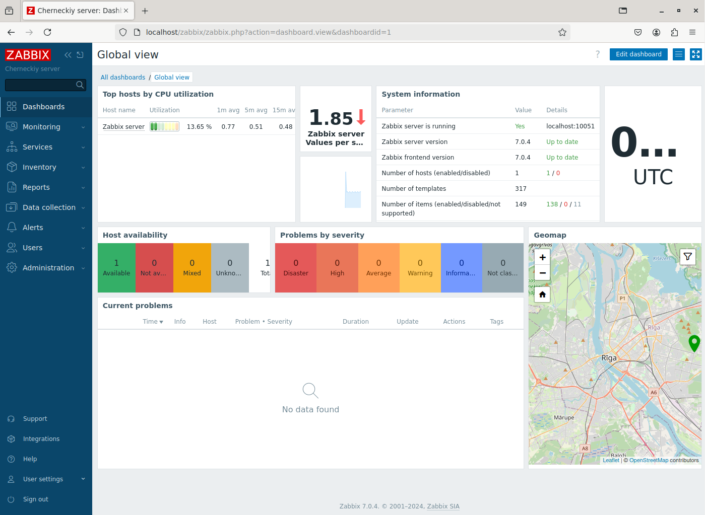
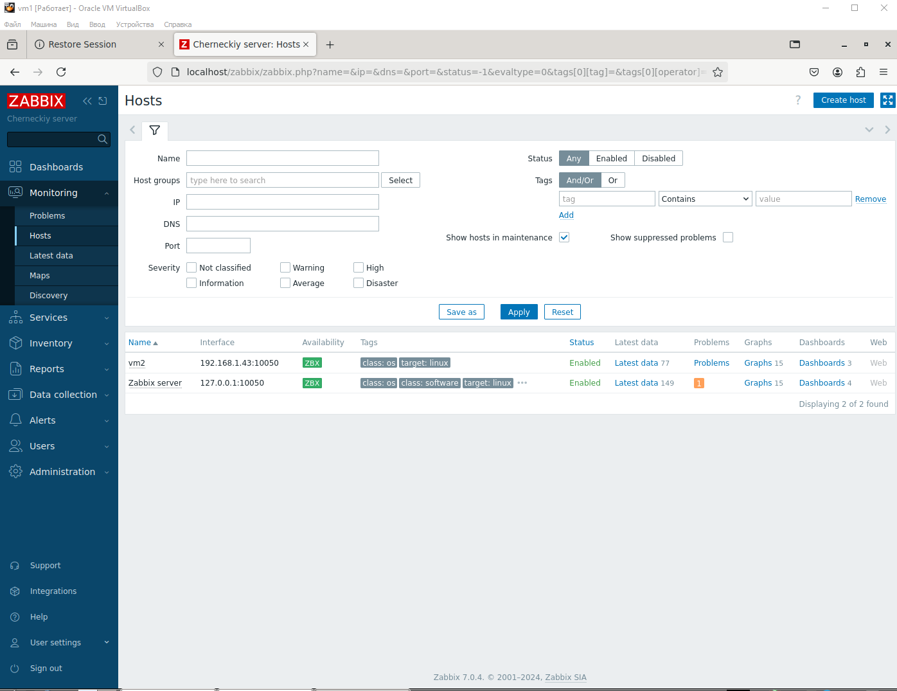
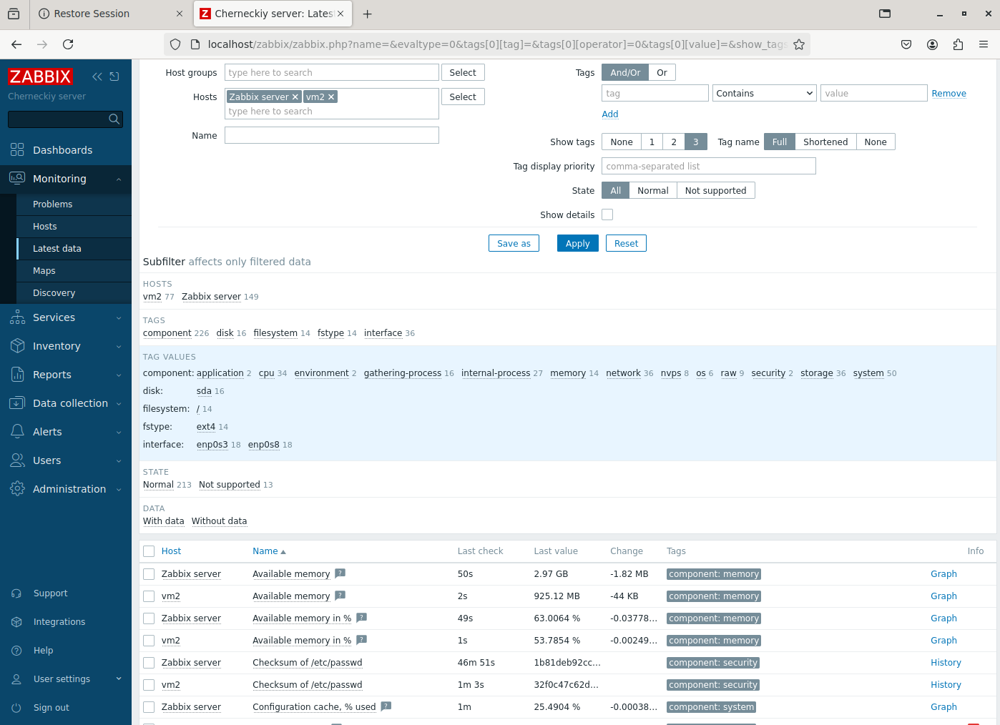
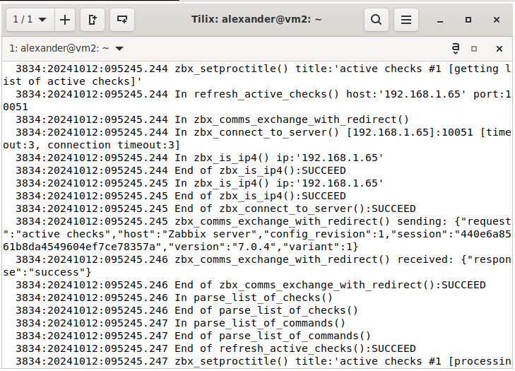

# Домашнее задание к занятию "`Система мониторинга Zabbix`" - `Чернецкий А.ВЮ`


### Инструкция по выполнению домашнего задания

   1. Сделайте `fork` данного репозитория к себе в Github и переименуйте его по названию или номеру занятия, например, https://github.com/имя-вашего-репозитория/git-hw или  https://github.com/имя-вашего-репозитория/7-1-ansible-hw).
   2. Выполните клонирование данного репозитория к себе на ПК с помощью команды `git clone`.
   3. Выполните домашнее задание и заполните у себя локально этот файл README.md:
      - впишите вверху название занятия и вашу фамилию и имя
      - в каждом задании добавьте решение в требуемом виде (текст/код/скриншоты/ссылка)
      - для корректного добавления скриншотов воспользуйтесь [инструкцией "Как вставить скриншот в шаблон с решением](https://github.com/netology-code/sys-pattern-homework/blob/main/screen-instruction.md)
      - при оформлении используйте возможности языка разметки md (коротко об этом можно посмотреть в [инструкции  по MarkDown](https://github.com/netology-code/sys-pattern-homework/blob/main/md-instruction.md))
   4. После завершения работы над домашним заданием сделайте коммит (`git commit -m "comment"`) и отправьте его на Github (`git push origin`);
   5. Для проверки домашнего задания преподавателем в личном кабинете прикрепите и отправьте ссылку на решение в виде md-файла в вашем Github.
   6. Любые вопросы по выполнению заданий спрашивайте в чате учебной группы и/или в разделе “Вопросы по заданию” в личном кабинете.
   
Желаем успехов в выполнении домашнего задания!
   
### Дополнительные материалы, которые могут быть полезны для выполнения задания

1. [Руководство по оформлению Markdown файлов](https://gist.github.com/Jekins/2bf2d0638163f1294637#Code)

---

### Задание 1


```
Install and configure Zabbix for your platform
a. Become root user
Start new shell session with root privileges.

$ sudo -s
b. Install Zabbix repository
Documentation
# wget https://repo.zabbix.com/zabbix/6.0/ubuntu/pool/main/z/zabbix-release/zabbix-release_6.0-4+ubuntu22.04_all.deb
# dpkg -i zabbix-release_6.0-4+ubuntu22.04_all.deb
# apt update
c. Install Zabbix server, frontend, agent
# apt install zabbix-server-pgsql zabbix-frontend-php php8.1-pgsql zabbix-apache-conf zabbix-sql-scripts zabbix-agent
d. Create initial database
Documentation
Make sure you have database server up and running.

Run the following on your database host.

# sudo -u postgres createuser --pwprompt zabbix
# sudo -u postgres createdb -O zabbix zabbix
On Zabbix server host import initial schema and data. You will be prompted to enter your newly created password.

# zcat /usr/share/zabbix-sql-scripts/postgresql/server.sql.gz | sudo -u zabbix psql zabbix
e. Configure the database for Zabbix server
Edit file /etc/zabbix/zabbix_server.conf

DBPassword=password
f. Start Zabbix server and agent processes
Start Zabbix server and agent processes and make it start at system boot.

# systemctl restart zabbix-server zabbix-agent apache2
# systemctl enable zabbix-server zabbix-agent apache2
g. Open Zabbix UI web page
The default URL for Zabbix UI when using Apache web server is http://host/zabbix

```





---

### Задание 2






```
alexander@linux:~$ cd zabbix1
alexander@linux:~/zabbix1$ https://github.com/netology-code/sys-pattern-homework.git
bash: https://github.com/netology-code/sys-pattern-homework.git: No such file or directory
alexander@linux:~/zabbix1$ git clone https://github.com/netology-code/sys-pattern-homework.git
Cloning into 'sys-pattern-homework'...
remote: Enumerating objects: 73, done.
remote: Total 73 (delta 0), reused 0 (delta 0), pack-reused 73 (from 1)
Receiving objects: 100% (73/73), 3.58 MiB | 705.00 KiB/s, done.
Resolving deltas: 100% (27/27), done.
alexander@linux:~/zabbix1$ git remote remove origin
fatal: not a git repository (or any of the parent directories): .git
alexander@linux:~/zabbix1$ git remote add origin https://github.com/Alex2nder/zabbix1.git
fatal: not a git repository (or any of the parent directories): .git
alexander@linux:~/zabbix1$ cd sys-pattern-homework
alexander@linux:~/zabbix1/sys-pattern-homework$ git status
git remote -v
On branch main
Your branch is up to date with 'origin/main'.

nothing to commit, working tree clean
origin  https://github.com/netology-code/sys-pattern-homework.git (fetch)
origin  https://github.com/netology-code/sys-pattern-homework.git (push)
alexander@linux:~/zabbix1/sys-pattern-homework$ git remote remove origin
alexander@linux:~/zabbix1/sys-pattern-homework$ git remote add origin https://github.com/Alex2nder/zabbix1.git
alexander@linux:~/zabbix1/sys-pattern-homework$ git push -u origin main
Enumerating objects: 73, done.
Counting objects: 100% (73/73), done.
Delta compression using up to 4 threads
Compressing objects: 100% (42/42), done.
Writing objects: 100% (73/73), 3.58 MiB | 33.00 KiB/s, done.
Total 73 (delta 27), reused 73 (delta 27), pack-reused 0
remote: Resolving deltas: 100% (27/27), done.
To https://github.com/Alex2nder/zabbix1.git
 * [new branch]      main -> main
Branch 'main' set up to track remote branch 'main' from 'origin'.
alexander@linux:~/zabbix1/sys-pattern-homework$ git add .
alexander@linux:~/zabbix1/sys-pattern-homework$ git commit -m "Коммит изменени .md "
[main a6a30b0] Коммит изменени .md
 11 files changed, 78 insertions(+), 72 deletions(-)
 create mode 100644 img/1.png
 create mode 100644 img/admin.png
 create mode 100644 img/data.png
 delete mode 100644 img/img15.png
 delete mode 100644 img/img16.png
 delete mode 100644 img/img17.png
 delete mode 100644 img/img18.png
 delete mode 100644 img/img19.png
 delete mode 100644 img/img20.png
 create mode 100644 img/server_con.png
alexander@linux:~/zabbix1/sys-pattern-homework$ git push origin main
Enumerating objects: 11, done.
Counting objects: 100% (11/11), done.
Delta compression using up to 4 threads
Compressing objects: 100% (8/8), done.
Writing objects: 100% (8/8), 605.12 KiB | 8.07 MiB/s, done.
Total 8 (delta 0), reused 0 (delta 0), pack-reused 0
To https://github.com/Alex2nder/zabbix1.git
   7e21e2d..a6a30b0  main -> main
alexander@linux:~/zabbix1/sys-pattern-homework$ ```


---


